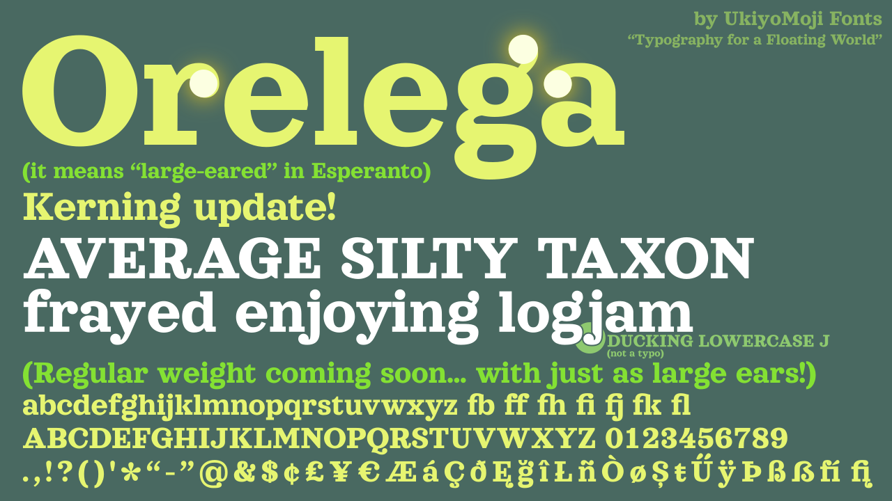

# About

Orelega is a whimsical Clarendon font with oversized ears. Its design was based on Sagona Extra Bold by René Bieder (available on [MyFonts](https://www.myfonts.com/fonts/rene-bieder/sagona/)), but it is far from a shameless copy. Everything has been redrawn from the ground up, with many new aesthetic changes in letterform, such as:

* the completely slabby serifs without round corners, except for very large serifs in “E”, “F”, “T”, and “Z”
* the cursive-inspired “Q”
* the more traditional Clarendon “R”
* the fancier “&”
* the uninterrupted slash
* the (relatively) open apertures on “c” and “e”
* the even bigger ear on “g”
* less clashy ligatures, even with accented “i”
* more contemporary Sulzbacher (3-like) “ß” (plus the new capital “ẞ”)
* the completely original and even *earier* diacritical marks (like cedilla, tilde and ogonek).
* the Regular weight with the same big ear size as Bold!

However,it lacks many extra features of Sagona, like full weights, italics, swash letters, small caps, all-caps alternates, and other stylistic alternates.

# Name

*Orelega* is Esperanto for “large-eared”. It is composed of *[orel-](https://en.wiktionary.org/wiki/orelo#Esperanto)* “ear”, *[-eg-](https://en.wiktionary.org/wiki/-eg-#Esperanto)* [augments degree or size], and *[-a](https://en.wiktionary.org/wiki/-a#Esperanto)* [adjective ending].

# Edit/Build instructions

Because I cannot afford Glyphs, Orelega is developed on the free font editor FontForge. Simply load the project in the directory ``/fontforge/`` and edit there.

To export to a font file, open the project and navigate to File > Generate. Then on the dialog box, choose your file name, save location, and format, then press Generate again.

# TODO
* kerning is incomplete (f + diacritics exceptions)
* regular weight has not started