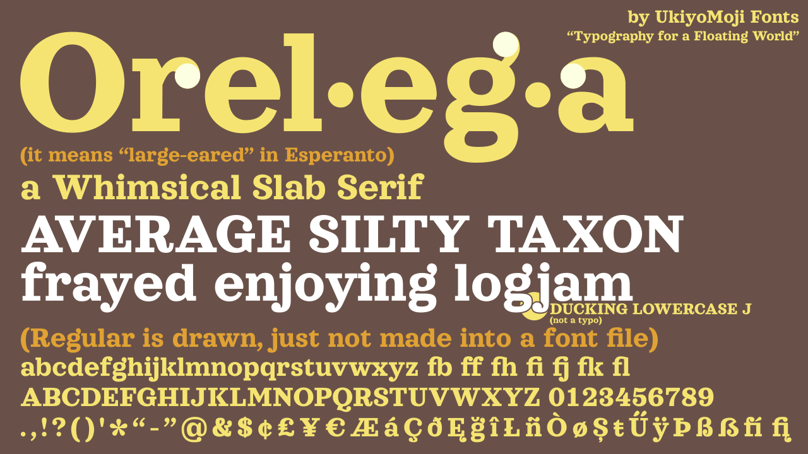

# Test Drive

Click [here](https://codepen.io/japanyoshi/full/ExgRwLK) to try the font.

# About

Orelega (pronounced in English: [/ˌɔːrəˈleɪ̯ɡə/](https://en.wikipedia.org/wiki/Help:IPA/English), in Esperanto: [/oreˈleɡa/](https://en.wikipedia.org/wiki/Help:IPA/Esperanto)) is a whimsical Clarendon font with oversized ears. Its design was based on Sagona Extra Bold by René Bieder (available on [MyFonts](https://www.myfonts.com/fonts/rene-bieder/sagona/)), but it is not a shameless copy. Everything has been redrawn from the ground up, with many new aesthetic changes in letterform, such as:

* **Latin:**
  * the completely slabby serifs without round corners, except for very large serifs in “E”, “F”, “T”, and “Z”
  * the cursive-inspired “Q”
  * the more traditional Clarendon “R”
  * the (relatively) open apertures on “c” and “e”
  * the consistently even-bigger ear on “g”
  * less clashy ligatures, even with accented “i” (e.g. fì)
  * *international:* full coverage of [Latin Extended-A](https://en.wikipedia.org/wiki/Latin_Extended-A) letters, plus «ɑ ∃Əə Ǫǫ Șș ẞ Țț Ʒʒ»
  * *German:* more contemporary Sulzbacher (“3”-like) “ß” (plus the new capital “ẞ”)
  * *Turkish:* clear difference between “fı” and “fi” ligatures
  * *Dutch:* accented “IJ” and “ij” ligature substitution (requires Dutch language setting)
* **Symbols:**
  * the fancier “&”
  * the uninterrupted slash
  * the completely original and even bigger-eared diacritical marks (like cedilla, tilde and ogonek).
* **Cyrillic (not supported by Sagona):**
  * swashy ascender on «б» and swashy descender on «ц щ» inspired by [Alice](https://www.fontsquirrel.com/fonts/alice) by Cyreal
  * traditional curly diagonals for «Жж Кк Яя» and trapezoidal flat-top form for «Дд Лл»

However, it lacks many extra features of Sagona, like full weights, italics, swash letters, small caps, all-caps alternates, and other stylistic alternates.

# Name

*Orelega* is Esperanto for “large-eared”. It is composed of *[orel(o)-](https://en.wiktionary.org/wiki/orelo#Esperanto)* “ear”, *[-eg-](https://en.wiktionary.org/wiki/-eg-#Esperanto)* [augments degree or size], and *[-a](https://en.wiktionary.org/wiki/-a#Esperanto)* [adjective ending].

# Edit/Build instructions

Because I cannot afford Glyphs, Orelega is developed on the free font editor FontForge. Simply load the project in the directory ``/fontforge/`` and edit there.

To export to a font file, open the project and navigate to File > Generate. Then on the dialog box, choose your file name, save location, and format, then press Generate again.

# Known issues
* kerning is imperfect
* regular weight has been drawn, but not assembled as a font file (In progress at [branch `regular-weight`](https://github.com/japanyoshi/orelega/tree/regular-weight))
